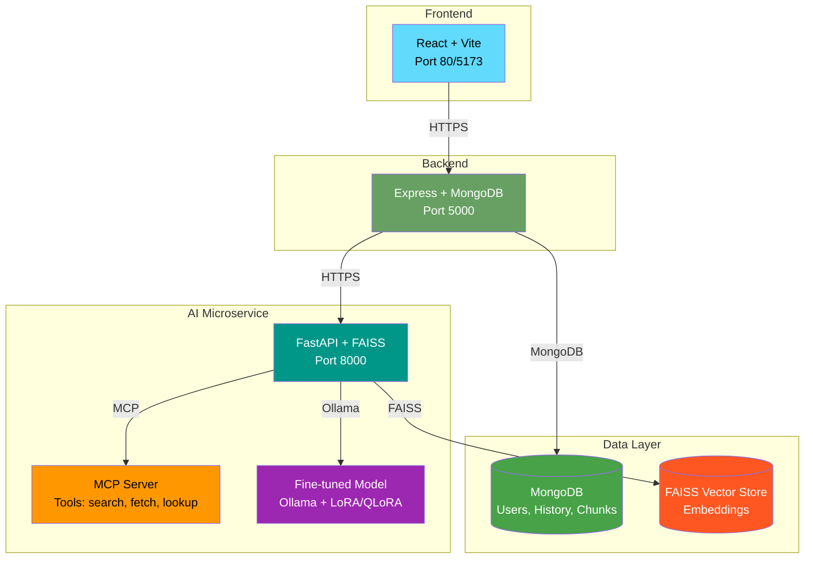

# IntelliDocs

An **agentic RAG (Retrieval-Augmented Generation) research assistant**. Upload
documents, ask questions, and get answers grounded in your own documents with
citable sources. Features an agent that routes between RAG, tool calls, and
clarifying questions, with optional fine-tuned local models and hybrid search.

> **Status:** Week 4 — complete (fine-tuning, hybrid search, containerization, CI/CD, deployment).

## Architecture



### Services

| Service | Tech | Port | Purpose |
|---------|------|------|---------|
| `ai-service` | Python 3.11 + FastAPI + FAISS | 8000 | Ingestion, embeddings, RAG chain, agent, MCP tools, fine-tuning |
| `server` | Node.js + Express + Mongoose | 5000 | Auth, chat history, API proxy to AI service |
| `client` | React + Vite + nginx | 80/5173 | Chat UI, document upload, admin dashboard |
| `mongodb` | MongoDB 7 | 27017 | Users, chat history, document chunks (for hybrid search) |

### Repository Structure

```
intellidocs/
├── ai-service/                    # Python FastAPI microservice
│   ├── app/
│   │   ├── main.py                # FastAPI entry point (/health, /ingest, /agent/query)
│   │   ├── config.py              # Central configuration (env vars, paths, models)
│   │   ├── ingestion.py           # Document load/split/embed/store (FAISS)
│   │   ├── rag_chain.py           # Retrieve + generate with structured output
│   │   ├── llm.py                 # LLM provider wrapper (groq/openai/anthropic/ollama/finetuned)
│   │   ├── schemas.py             # Pydantic models (Answer, Citation)
│   │   ├── agent_graph.py         # LangGraph agent (router → rag/tool/clarify)
│   │   ├── agent_nodes.py         # Agent node implementations
│   │   ├── mcp_server.py          # MCP server (stdio transport)
│   │   ├── mcp_tools.py           # MCP tool implementations
│   │   ├── hybrid_search.py       # Keyword + vector hybrid retrieval (RRF)
│   │   └── tracing.py             # LangSmith/W&B tracing
│   ├── finetune/
│   │   ├── build_dataset.py       # Generate Q&A pairs from ingested docs
│   │   ├── train_lora.py          # LoRA/QLoRA training (PEFT + bitsandbytes)
│   │   ├── quantize_export.py     # Merge LoRA → GGUF → Ollama Modelfile
│   │   └── dataset.jsonl          # Generated fine-tuning dataset
│   ├── eval/
│   │   ├── test_set.json          # Evaluation test cases
│   │   ├── run_eval.py            # Evaluation harness
│   │   └── human_eval_rubric.md   # Human evaluation guidelines
│   ├── data/                      # Uploaded documents (gitignored)
│   ├── chroma_db/                 # FAISS vector store (gitignored)
│   ├── Dockerfile                 # Multi-stage Docker build
│   ├── modal_app.py               # Modal deployment config
│   ├── requirements.txt
│   └── .env.example
├── server/                        # Express backend
│   ├── src/
│   │   ├── index.js               # Express entry point
│   │   ├── config/db.js           # MongoDB connection
│   │   ├── middleware/auth.js     # JWT authentication
│   │   ├── models/User.js         # User model (bcrypt)
│   │   ├── models/ChatMessage.js  # Chat message model
│   │   ├── routes/auth.js         # /api/auth/register, /login
│   │   ├── routes/chat.js         # /api/chat (proxy to AI service)
│   │   └── routes/eval.js         # /api/eval/latest
│   ├── Dockerfile                 # Multi-stage Docker build
│   ├── render.yaml                # Render deployment config
│   ├── package.json
│   └── .env.example
├── client/                        # React frontend
│   ├── src/
│   │   ├── App.jsx                # Main app with routing
│   │   ├── main.jsx               # Entry point
│   │   ├── index.css              # Global styles
│   │   ├── api/chatApi.js         # API client
│   │   ├── context/AuthContext.jsx # Auth state management
│   │   ├── components/
│   │   │   ├── ChatWindow.jsx     # Chat interface with citations
│   │   │   ├── Login.jsx          # Login form
│   │   │   ├── Register.jsx       # Registration form
│   │   │   └── EvalCharts.jsx     # Evaluation charts
│   │   └── pages/
│   │       └── AdminDashboard.jsx # Admin dashboard with eval metrics
│   ├── Dockerfile                 # Multi-stage build (Vite → nginx)
│   ├── nginx.conf                 # nginx config (SPA routing, caching)
│   ├── render.yaml                # Render static site config
│   ├── package.json
│   └── vite.config.js
├── .github/
│   └── workflows/ci.yml           # GitHub Actions CI/CD pipeline
├── docker-compose.yml             # Full stack local development
├── .gitignore
├── README.md                      # This file
└── DEVELOPMENT_PLAN.md            # Project plan with checklists
```

## Prerequisites

### Local Development
- **Python 3.11+**
- **Node.js LTS (18+)**
- **Docker & Docker Compose** (for containerized stack)
- **MongoDB** (local or Atlas) — `docker-compose` includes MongoDB
- **Ollama** (optional, for local/finetuned models) — https://ollama.ai

### Cloud Deployment
- **Modal account** (for AI service GPU) — https://modal.com
- **Render account** (for server + client) — https://render.com
- **MongoDB Atlas** (recommended for production) — https://mongodb.com/atlas
- **GitHub repository** (for CI/CD)

## Quick Start (Local Development)

### Option 1: Docker Compose (Recommended)

```bash
# 1. Clone and navigate
git clone <your-repo>
cd intellidocs

# 2. Copy environment files
cp ai-service/.env.example ai-service/.env
cp server/.env.example server/.env

# 3. Edit .env files with your API keys (at minimum GROQ_API_KEY)
# ai-service/.env: GROQ_API_KEY=your_key_here
# server/.env: JWT_SECRET=your_random_secret_here

# 4. Start all services
docker-compose up --build -d

# 5. Verify
curl http://localhost:8000/health   # AI service
curl http://localhost:5000/api/health  # Server
curl http://localhost/              # Client (nginx)

# 6. Open http://localhost in browser
```

### Option 2: Manual (for development)

```bash
# Terminal 1: AI Service
cd ai-service
python -m venv venv
source venv/bin/activate  # Windows: venv\Scripts\activate
pip install -r requirements.txt
cp .env.example .env
# Edit .env with your keys
uvicorn app.main:app --reload --port 8000

# Terminal 2: Server
cd server
npm install
cp .env.example .env
# Edit .env
npm run dev

# Terminal 3: Client
cd client
npm install
npm run dev

# Terminal 4 (optional): MCP Server
cd ai-service
source venv/bin/activate
python -m app.mcp_server
```

## Environment Variables

### AI Service (`ai-service/.env`)

```env
# Embedding model
EMBEDDING_MODEL=all-MiniLM-L6-v2

# Storage paths
DATA_DIR=./data
CHROMA_DIR=./chroma_db

# LLM Provider: groq | openai | anthropic | ollama | finetuned
LLM_PROVIDER=groq

# Groq (if LLM_PROVIDER=groq)
GROQ_API_KEY=your_groq_key
GROQ_MODEL=llama-3.1-8b-instant

# OpenAI (if LLM_PROVIDER=openai)
OPENAI_API_KEY=your_openai_key
OPENAI_MODEL=gpt-4o-mini

# Anthropic (if LLM_PROVIDER=anthropic)
ANTHROPIC_API_KEY=your_anthropic_key
ANTHROPIC_MODEL=claude-3-5-haiku-latest

# Ollama (if LLM_PROVIDER=ollama)
OLLAMA_BASE_URL=http://localhost:11434
OLLAMA_MODEL=llama3.1:8b

# Fine-tuned model (if LLM_PROVIDER=finetuned)
FINETUNED_MODEL=intellidocs-finetuned

# Retrieval mode: vector | hybrid
RETRIEVAL_MODE=vector
TOP_K=4

# CORS - comma-separated list of allowed origins
# Development: http://localhost:5173,http://localhost:3000,http://localhost
# Production: https://your-frontend-domain.com
ALLOWED_ORIGINS=http://localhost:5173,http://localhost:3000,http://localhost
```

### Server (`server/.env`)

```env
PORT=5000
MONGODB_URI=mongodb://localhost:27017/intellidocs
AI_SERVICE_URL=http://localhost:8000
JWT_SECRET=your-super-secret-jwt-key-change-in-production

# CORS - comma-separated list of allowed client origins
# Development: http://localhost:5173,http://localhost:3000
# Production: https://your-frontend-domain.com
CLIENT_URL=http://localhost:5173,http://localhost:3000
```

### Client (`client/.env` - optional)

```env
VITE_API_URL=http://localhost:5000/api
```

Copy `client/.env.example` to `client/.env` and adjust as needed.

## Fine-Tuning (Week 4)

IntelliDocs supports fine-tuning a local model on your domain-specific documents using LoRA/QLoRA.

### Hardware Requirements

| Model | 4-bit QLoRA VRAM | Recommended GPU |
|-------|------------------|-----------------|
| Llama 3.1 8B | ~8 GB | RTX 3080/4080, A10G, T4 |
| Mistral 7B | ~6 GB | RTX 3060 12GB, T4 |
| Phi-3 Mini | ~4 GB | RTX 3060 8GB |

**No GPU?** Use Modal or Google Colab for training (see below).

### Step 1: Generate Dataset

```bash
cd ai-service
source venv/bin/activate

# Generate Q&A pairs from ingested documents
python -m finetune.build_dataset --pairs-per-chunk 2 --min-pairs 150

# Output: finetune/dataset.jsonl (instruction-tuning format)
```

**Target:** 150-300 examples. If your document set is small:
- Ingest more documents via `/ingest` endpoint
- Increase `--pairs-per-chunk` to 3
- Use a more capable LLM for generation (Groq/OpenAI vs Ollama)

### Step 2: Train LoRA Adapter

**Local GPU (8GB+ VRAM):**
```bash
python -m finetune.train_lora --epochs 3 --batch-size 1
```

**Modal Cloud GPU (recommended for AMD/integrated graphics):**
```bash
# Install Modal CLI
pip install modal
modal setup

# Deploy and run training on Modal A10G
modal run modal_app.py::train_finetuned
```

**Google Colab (free T4 GPU):**
1. Upload `finetune/train_lora.py` and `finetune/dataset.jsonl` to Colab
2. Install dependencies: `pip install transformers peft datasets bitsandbytes accelerate`
3. Run the script in a notebook cell

**Output:** `finetune/lora_adapter/` (LoRA adapter weights)

### Step 3: Export to GGUF for Ollama

```bash
# Option A: Modelfile approach (recommended - smaller, uses Ollama's LoRA support)
python -m finetune.quantize_export --method modelfile

# Option B: Standalone GGUF (requires llama.cpp)
python -m finetune.quantize_export --method gguf --quantization Q4_K_M
```

**Modal:**
```bash
modal run modal_app.py::export_gguf
```

### Step 4: Use Fine-Tuned Model

```bash
# The quantize_export script creates the Ollama model automatically
# Verify it's available:
ollama list | grep intellidocs

# Update ai-service/.env:
LLM_PROVIDER=finetuned
FINETUNED_MODEL=intellidocs-finetuned

# Restart AI service
uvicorn app.main:app --reload
```

### Evaluate Fine-Tuned Model

```bash
# Run evaluation with fine-tuned model
cd ai-service
LLM_PROVIDER=finetuned python -m eval.run_eval

# Compare with base model
LLM_PROVIDER=ollama python -m eval.run_eval
```

## Hybrid Search (Week 4)

IntelliDocs supports hybrid retrieval combining keyword (BM25) and vector (FAISS) search.

### Two Modes

| Mode | Description | Use Case |
|------|-------------|----------|
| `vector` | Pure FAISS similarity search | Default, semantic queries |
| `hybrid` | Keyword (MongoDB text index) + Vector (FAISS) merged with RRF | Exact terms, acronyms, proper nouns |

### Configuration

```env
# ai-service/.env
RETRIEVAL_MODE=hybrid  # or "vector"
```

### How It Works

1. **Keyword Search**: MongoDB text index on chunk text (BM25 scoring)
2. **Vector Search**: FAISS similarity search (cosine similarity)
3. **Fusion**: Reciprocal Rank Fusion (RRF) with k=60
   - `score = Σ 1/(60 + rank_i)` for each result list
   - Parameter-free, robust to score scale differences

### Local vs Atlas

| Setup | Keyword Search | Vector Search | Fusion |
|-------|----------------|---------------|--------|
| **Local MongoDB** | MongoDB text index | FAISS (local) | Python RRF |
| **MongoDB Atlas** | Atlas Search (Lucene) | Atlas Vector Search | Server-side `$search` compound |

The local implementation is a **development fallback** — not a production Atlas equivalent. For production, use Atlas M10+ cluster with both search indexes.

### Compare Retrieval Quality

```bash
cd ai-service
source venv/bin/activate

# Test vector-only
RETRIEVAL_MODE=vector python -c "
from app.hybrid_search import hybrid_retrieve
results = hybrid_retrieve('machine learning', top_k=4)
for r in results: print(r['metadata'].get('source'), r['text'][:100])
"

# Test hybrid
RETRIEVAL_MODE=hybrid python -c "
from app.hybrid_search import hybrid_retrieve
results = hybrid_retrieve('machine learning', top_k=4)
for r in results: print(r['metadata'].get('source'), r['text'][:100])
"
```

## Containerization (Docker)

### Multi-Stage Builds

All three services use multi-stage Dockerfiles for minimal production images:

| Service | Base | Runtime Size | Strategy |
|---------|------|--------------|----------|
| ai-service | python:3.11-slim | ~500MB | Builder installs deps, runtime copies only site-packages |
| server | node:20-alpine | ~150MB | Builder installs all deps, runtime copies only prod deps |
| client | node:20-alpine → nginx:alpine | ~20MB | Builder runs `npm run build`, nginx serves static files |

### Build Images

```bash
# Build all
docker-compose build

# Build individual
docker build -t intellidocs-ai-service ./ai-service
docker build -t intellidocs-server ./server
docker build -t intellidocs-client ./client
```

### Run with Docker Compose

```bash
# Start all services
docker-compose up -d

# View logs
docker-compose logs -f ai-service
docker-compose logs -f server
docker-compose logs -f client

# Stop
docker-compose down

# Stop and remove volumes (⚠️ data loss!)
docker-compose down -v
```

**Linux Users (Ollama):** The default `docker-compose.yml` uses `host.docker.internal` for Ollama, which only works on Docker Desktop (Mac/Windows). On Linux, you have two options:

1. **Run Ollama in Docker** (recommended): Uncomment the `ollama` service in `docker-compose.yml` and set `OLLAMA_BASE_URL=http://ollama:11434` in the ai-service environment.

2. **Use host network mode**: Add `network_mode: "host"` to the ai-service service (but this loses Docker network isolation).

See the commented `ollama` service in `docker-compose.yml` for details.

## CI/CD Pipeline (GitHub Actions)

The `.github/workflows/ci.yml` pipeline runs on every push:

### Jobs

1. **lint-and-test** (ubuntu-latest)
   - Python: ruff lint, pytest (smoke test)
   - Node: ESLint, build check
   - Runs on all pushes and PRs

2. **build-images** (ubuntu-latest)
   - Builds and pushes Docker images to GHCR
   - Uses BuildKit cache for speed
   - Runs on pushes and PRs

3. **deploy** (ubuntu-latest, `main` branch only)
   - Deploys AI service to Modal
   - Triggers Render deploy for server + client
   - Health checks deployed endpoints

### Required GitHub Secrets

| Secret | Description | Required For |
|--------|-------------|--------------|
| `MODAL_TOKEN_ID` | Modal auth token ID | AI service deploy |
| `MODAL_TOKEN_SECRET` | Modal auth token secret | AI service deploy |
| `RENDER_API_KEY` | Render API key | Server/client deploy |
| `RENDER_SERVICE_ID_SERVER` | Render service ID (server) | Server deploy |
| `RENDER_SERVICE_ID_CLIENT` | Render service ID (client) | Client deploy |
| `GROQ_API_KEY` | Groq API key | AI service runtime |
| `OPENAI_API_KEY` | OpenAI API key | AI service runtime |
| `ANTHROPIC_API_KEY` | Anthropic API key | AI service runtime |
| `MONGODB_URI` | MongoDB Atlas URI | Production database |
| `JWT_SECRET` | JWT signing secret | Server runtime |
| `AI_SERVICE_URL` | Deployed AI service URL | Server runtime |
| `SERVER_URL` | Deployed server URL | Health checks |
| `CLIENT_URL` | Deployed client URL | Health checks |

### Setup Secrets

1. Go to GitHub repo → Settings → Secrets and variables → Actions
2. Add each secret above
3. For Modal: `modal token new` → copy ID and secret
4. For Render: Account Settings → API Keys → create key

## Deployment

### AI Service → Modal (GPU)

**Why Modal?**
- Per-second GPU billing (T4: $0.73/hr, A10G: $1.14/hr)
- Scale to zero (no cost when idle)
- Native Python, no Docker required (but supports Dockerfile)
- Automatic HTTPS, custom domains, secrets management

**Deploy:**
```bash
cd ai-service
modal deploy modal_app.py
```

**Configure in Modal Dashboard:**
1. Secrets → Create "intellidocs-ai-secrets" with all API keys
2. Volumes → Create "intellidocs-vector-store", "intellidocs-data", "intellidocs-finetune"
3. Domains → Add custom domain (optional)

**GPU Selection** (in `modal_app.py`):
```python
GPU_CONFIG = "T4"  # or "A10G" for larger models
```

### Server + Client → Render

**Why Render?**
- Free tier: 750 hrs/month web service, unlimited static sites
- Auto-deploy from GitHub
- Managed PostgreSQL/Redis (if needed)
- Custom domains, HTTPS, DDoS protection

**Deploy Server:**
1. Render Dashboard → New → Web Service
2. Connect GitHub repo → select `server/` folder
3. Render detects `render.yaml` automatically
4. Add environment variables in Render dashboard:
   - `MONGODB_URI` (Atlas connection string)
   - `AI_SERVICE_URL` (your Modal app URL)
   - `JWT_SECRET` (strong random string)
5. Deploy

**Deploy Client:**
1. Render Dashboard → New → Static Site
2. Connect GitHub repo → select `client/` folder
3. Render detects `render.yaml` automatically
4. Add environment variable:
   - `VITE_API_URL` = `https://your-server.onrender.com/api`
5. Deploy

### MongoDB → Atlas (Production)

1. Create MongoDB Atlas cluster (M0 free tier or M10+ for vector search)
2. Create database user and get connection string
3. Add to GitHub secrets as `MONGODB_URI`
4. Add to Render environment variables
5. Add to Modal secrets

**For Hybrid Search on Atlas:**
- Upgrade to M10+ cluster
- Create Atlas Search index named `search_index` on `chunks.text`
- Create Atlas Vector Search index named `vector_index` on `chunks.embedding`
- Set `RETRIEVAL_MODE=hybrid` (code auto-detects Atlas URI)

### CORS Configuration

CORS is now configured via environment variables in both services. Set these in your deployment platform's dashboard:

**AI Service (`ALLOWED_ORIGINS`):**
```bash
# Comma-separated list of allowed origins
ALLOWED_ORIGINS=https://your-client.onrender.com,https://your-custom-domain.com
```

**Server (`CLIENT_URL`):**
```bash
# Comma-separated list of allowed client origins
CLIENT_URL=https://your-client.onrender.com,https://your-custom-domain.com
```

The code reads these at startup:
- `ai-service/app/main.py` reads `ALLOWED_ORIGINS` env var
- `server/src/index.js` reads `CLIENT_URL` env var

No code changes needed for deployment — just set the environment variables.

## Evaluation

### Automated Evaluation

```bash
cd ai-service
source venv/bin/activate

# Run full evaluation
python -m eval.run_eval

# Output: eval_report_YYYYMMDD_HHMMSS.json with:
# - Accuracy (path_correct, tool_correct, answer_score)
# - Latency (ms)
# - Cost (USD, estimated)
# - Per-question breakdown
```

### Human Evaluation

See `ai-service/eval/human_eval_rubric.md` for guidelines on:
- Relevance (1-5)
- Faithfulness (1-5) 
- Helpfulness (1-5)

### Admin Dashboard

Visit `/admin` in the frontend (requires login) to view:
- Accuracy/latency/cost charts
- Human evaluation summary
- Latest eval report

## Demo Script

For a live demonstration, follow this sequence:

1. **Register & Login**
   - Open deployed client URL
   - Register new account
   - Verify redirect to chat

2. **Document Upload**
   - Click "📄 Upload Document"
   - Select a PDF/TXT file
   - Verify ingestion success message

3. **RAG-Grounded Answer**
   - Ask: "What is the main topic of the document?"
   - Verify answer with citations (source, excerpt)
   - Verify confidence badge (high/medium/low)

4. **Tool-Triggered Answer**
   - Ask: "Search for information about [specific term in doc]"
   - Verify agent routes to `search_documents` tool
   - Verify answer incorporates tool results

5. **Clarifying Question**
   - Ask: "Tell me about it"
   - Verify agent asks for clarification
   - Provide clarification → verify answer

6. **Hybrid Search Comparison**
   - In AI service logs, observe `RETRIEVAL_MODE=hybrid`
   - Compare retrieved chunks vs vector-only

7. **Fine-Tuned Model**
   - Switch `LLM_PROVIDER=finetuned`
   - Ask same questions
   - Compare answer quality/style

8. **Admin Dashboard**
   - Navigate to `/admin`
   - View evaluation charts
   - Show human eval scores

9. **History Persistence**
   - Refresh page → verify history loads
   - Logout → login → verify history persists

## Known Limitations & Next Steps

### Current Limitations

1. **FAISS Vector Store**
   - No metadata filtering (unlike Chroma)
   - `lookup_metadata` tool does broad search + filter
   - *Fix:* Migrate to Chroma or Qdrant for production

2. **Local Hybrid Search**
   - MongoDB text index + FAISS + Python RRF
   - Not true Atlas Search + Atlas Vector Search
   - *Fix:* Use Atlas M10+ for production hybrid search

3. **Single-Threaded Ingestion**
   - Large PDFs block the event loop
   - *Fix:* Background jobs with Celery/RQ

4. **No Streaming Responses**
   - Agent returns complete answer at once
   - *Fix:* Implement `stream_agent` in LangGraph + SSE

5. **Limited Multi-Turn Context**
   - Agent has basic history but no conversation memory
   - *Fix:* Add conversation summarization or long-term memory

6. **Fine-Tuning Dataset Size**
   - Small document sets → small training data
   - *Fix:* Data augmentation, synthetic Q&A generation

7. **No Rate Limiting**
   - API endpoints unprotected
   - *Fix:* Add rate limiting middleware

### Next Steps (Post-Week 4)

- [ ] Migrate to Chroma/Qdrant for metadata filtering
- [ ] Implement streaming responses (SSE/WebSocket)
- [ ] Add conversation memory with summarization
- [ ] Implement rate limiting and API keys
- [ ] Add document deletion and re-ingestion
- [ ] Support more file types (DOCX, PPTX, HTML)
- [ ] Multi-user document isolation (per-user collections)
- [ ] Add RAGAS/DeepEval for automated evaluation
- [ ] Implement feedback loop (thumbs up/down → retraining)
- [ ] Add observability dashboards (Grafana/Prometheus)

## Troubleshooting

### Common Issues

**AI Service won't start:**
- Check `GROQ_API_KEY` or other provider keys in `.env`
- Verify FAISS index exists: `ls ai-service/chroma_db/`
- Check Python version: `python --version` (3.11+)

**MongoDB connection failed:**
- Verify `MONGODB_URI` in server/.env
- For local: `docker-compose up mongodb`
- For Atlas: Check IP whitelist and credentials

**Ollama model not found:**
- `ollama pull llama3.1:8b`
- Check `OLLAMA_BASE_URL` (default: http://localhost:11434)
- Verify model name: `ollama list`

**Docker build fails:**
- Clear cache: `docker system prune -a`
- Check Dockerfile syntax
- Verify all COPY paths exist

**Modal deploy fails:**
- `modal token new` to refresh auth
- Check secrets in Modal dashboard
- Verify GPU quota in Modal settings

**Render deploy fails:**
- Check build logs in Render dashboard
- Verify `render.yaml` syntax
- Check environment variables are set

## License

MIT License — see LICENSE file for details.

## Contributing

1. Fork the repository
2. Create feature branch: `git checkout -b feature/amazing-feature`
3. Commit changes: `git commit -m 'Add amazing feature'`
4. Push to branch: `git push origin feature/amazing-feature`
5. Open a Pull Request

---

**Built with:** FastAPI, LangGraph, FAISS, MongoDB, Express, React, Vite, Modal, Render, Ollama, PEFT, bitsandbytes